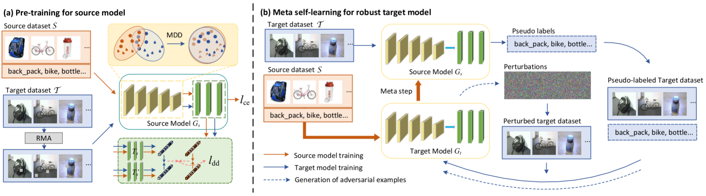

# SRoUDA: Meta Self-training for Robust Unsupervised Domain Adaptation

This is the official code for AAAI'23 "Meta Self-training for Robust Unsupervised Domain Adaptation". The paper can be download [here](http://arxiv.org/abs/2212.05917).

## Prerequisites
- python >= 3.6
- pytorch >= 1.3
- CUDA >= 10.1


## Dataset

Following datasets can be downloaded automatically:

- [MNIST](http://yann.lecun.com/exdb/mnist/), [SVHN](http://ufldl.stanford.edu/housenumbers/), [USPS](https://www.csie.ntu.edu.tw/~cjlin/libsvmtools/datasets/multiclass.html#usps) 
- [Office31](https://www.cc.gatech.edu/~judy/domainadapt/)

## Introduction
The framwork of our SRoUDA pipeline, which consists of two phases: (a) Pre-train the source model Gs with RMA in 
target domain to mitigate the domain bias. (b) Train the target model on adversarial examples generated by pseudo-labeled target
data, while fine-tuning the source model by employing a meta-step which is the feedback of the target model’s performance on
source labeled data.



## Result
We validate our proposed SRoUDA on three backbones for fair comparison with SOTAs. 
Specifically, we use ResNet-50 on Office-31, DTN on Digits dataset. 
During the pre-training of source model, we adopt the training settings 
of the popular UDA codebase DALIB and train the source model for 20 epochs with a 
learning rate of 0.004.

| DATA SET | pre-train mothod | task | clean acc | robust acc | 
|:--------:|:----------------:|:----:|:---------:|:----------:|
| office31 |       MDD        | A2W  |  95.97%   |   84.68%   |
| office31 |       MDD        | A2D  |  91.94%   |   85.48%   |
| office31 |       MDD        | W2A  |  67.10%   |   57.42%   |
| office31 |       MDD        | W2D  |   100%    |   88.71%   |
| office31 |       MDD        | D2A  |  72.47%   |   57.21%   |
| office31 |       MDD        | D2W  |  96.77%   |   83.87%   |
|  Digits  |       MDD        | M2U  |  95.02%   |   87.59%   |
|  Digits  |       MDD        | U2M  |  98.50%   |   96.44%   |
|  Digits  |       MDD        | S2M  |  88.72%   |   87.16%   |


## Experiment
- (a) Pre-train for source model

The shell files give the script to reproduce the results with specified hyper-parameters.

- (b) Meta self-leaning for robust target model

For example, if you want to train SRoUDA on Office31, use the following script

```shell script
# Train a SRoUDA on Office-31 Amazon -> Webcam task using ResNet 50.
# Assume you have put the datasets under the path `data/office-31`, 
# or you are glad to download the datasets automatically from the Internet to this path
CUDA_VISIBLE_DEVICES=0 python main.py --root data/office31 -d Office31 -s A -t W -a resnet50 --total-steps 20000 --Matebatch-size 4 --mu 8 --teacher_lr 1e-6 --student_lr 0.001 --bottleneck-dim 1024 --seed 1 --model-path UDA_pretrain/logs/mdd/Office31_A2W/checkpoints/best.pth --log checkpoints/Office31_A2W_SRoUDA --name Office31_A2W
```
if you want to train SRoUDA on Digits, use the following script

```shell script
# Train a SRoUDA on Digits SVHN -> MNIST task using DTN.
# Assume you have put the datasets under the path `data/digits`, 
# or you are glad to download the datasets automatically from the Internet to this path
CUDA_VISIBLE_DEVICES=0 python main.py --root data/digits -d Digits -s SVHNRGB -t MNISTRGB --train-resizing 'res.' --val-resizing 'res.'  --resize-size 32 \
  --no-hflip --norm-mean 0.5 0.5 0.5 --norm-std 0.5 0.5 0.5 -a dtn --no-pool --total-steps 20000 --teacher_lr 1e-4 --student_lr 0.01 --Matebatch-size 16 --mu 8 --scratch --seed 0 --model-path UDA_pretrain/logs/mdd/SVHN2MNIST/checkpoints/best.pth --log logs/mdd/SVHN2MNIST --name SVHN2MNIST
```

## Citation

If you use our methods in your research, please consider citing.

```
@inproceedings{Zhu2022SRoUDAMS,
  title={SRoUDA: Meta Self-training for Robust Unsupervised Domain Adaptation},
  author={Wanqing Zhu and Jia-Li Yin and Bo-Hao Chen and Ximeng Liu},
  year={2022}
}

```
